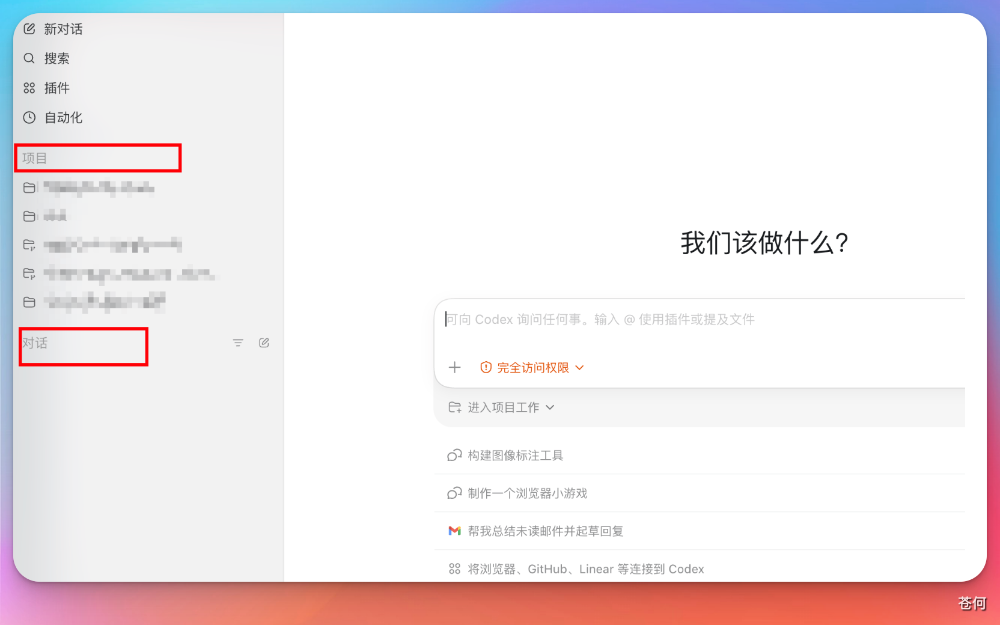
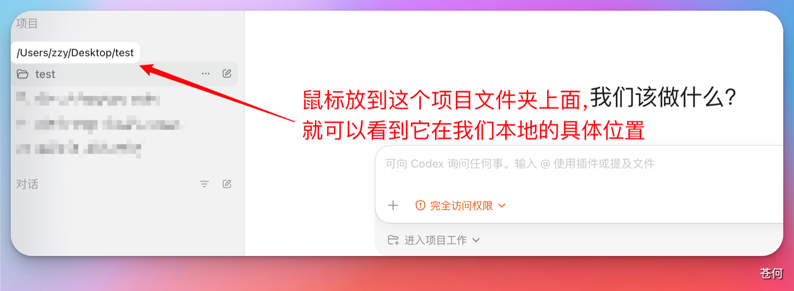
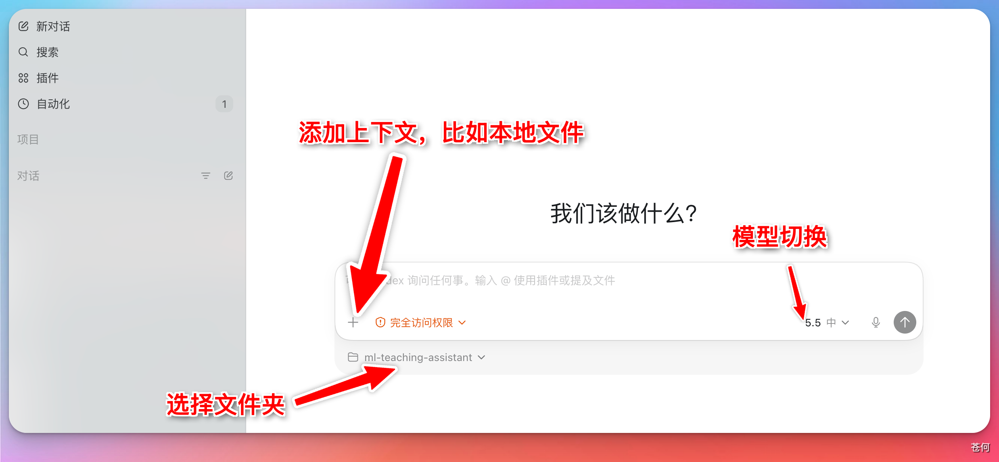
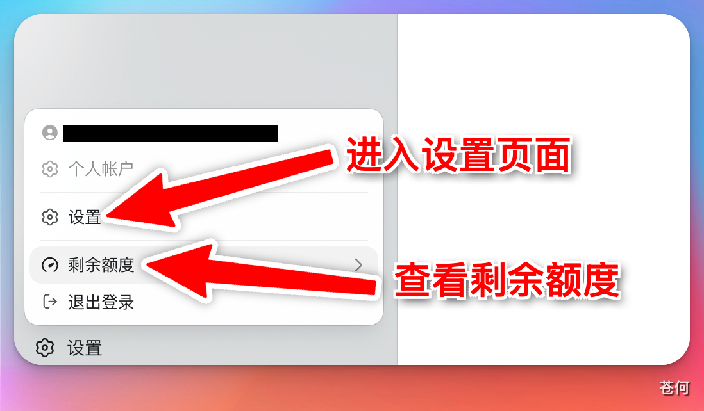
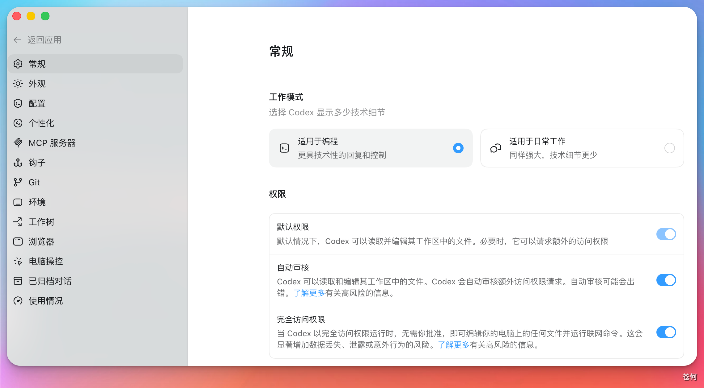
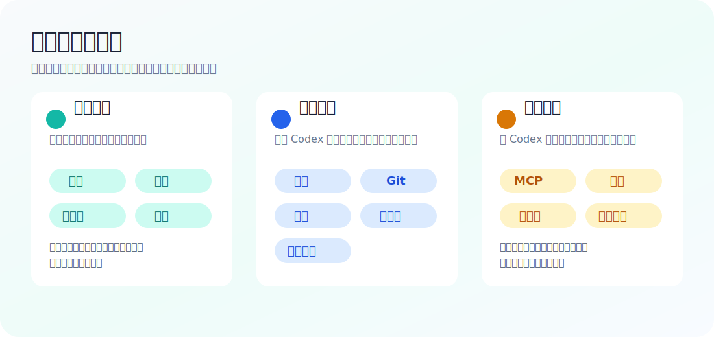

# 了解 Codex 基本组成

::: tip 最后核对
官方资料最后核对日期：2026-05-27。本章参考 [Codex App docs](https://developers.openai.com/codex/app)、[Settings](https://developers.openai.com/codex/app/settings)、[Agent approvals and security](https://developers.openai.com/codex/agent-approvals-security) 等官方资料。界面说明以当前 Codex 桌面 App 实际版本为准，不同系统、地区、客户端版本和账号套餐下显示可能略有差异。
:::

## 认识对话和项目

打开 Codex 桌面 App，左侧栏包含两个主要入口：**Chat（对话）** 和 **Project（项目）**。

**Chat 对话**

与 ChatGPT 网页端对话体验基本一致，适合处理日常的、一次性的问答和简单任务。每个对话相互独立，不共享工作目录。

**Project 项目**

适合需要操作本地文件的任务，例如生成代码、编写文档、制作 PPT、完成报告。在项目里创建的所有对话都共享同一个本地工作目录，方便统一管理多个子任务。

在项目里下达指令后，Codex 的修改会直接应用到你本地文件夹中的文件。

## 对话框功能说明

Codex 桌面 App 的对话框与 ChatGPT 网页端类似，但额外提供了以下功能：

1. **添加上下文**：可以附加文件、截图或其他参考内容
2. **切换模型**：在不同模型之间切换
3. **控制权限**：设定 Codex 在当前任务中的操作权限
4. **选择工作目录**：指定 Codex 在哪个本地文件夹下执行任务

## 设置面板

点击左下角头像或设置图标可以打开设置面板。

上图左侧就是 Codex 桌面 App 的设置菜单。不要把它当成一次性必须填完的表单：新手只需要确认「常规」和「权限」能支撑第一个任务，其他设置等真实场景出现后再逐步打开。

## 新手先按这四步检查

1. **先选工作模式**：做代码、网站、脚本、仓库任务时选「适用于编程」；写文案、整理资料、做非代码任务时可以选「适用于日常工作」。
2. **先别急着开最大权限**：刚开始建议让 Codex 只在当前工作区内读写文件，遇到联网、系统文件、危险命令时再单独审批。
3. **先配置工作目录**：第一个任务尽量使用一个空文件夹或测试项目，不要直接把重要项目交给新手阶段的 Codex。
4. **先观察使用情况**：如果任务经常中断、额度告急或模型响应变慢，再回到「使用情况」和套餐页面确认限制。

::: warning 截图不是推荐配置
截图中的开关只是界面示例，不代表所有读者都应该照着开启。尤其是「完全访问权限」、浏览器控制、电脑操控、钩子和 MCP 服务器，第一次使用时都应该按任务逐步开启。
:::

## 设置逐项说明

  <section class="setting-card">
    <strong>常规</strong>
    
这里决定 Codex 默认以什么方式回答和执行任务。最重要的是「工作模式」和「权限」。如果你要跟着本教程做网页、脚本、代码修改，优先选「适用于编程」；它会保留更多技术细节、命令输出和变更说明。如果只是写提纲、整理资料或改文案，可以切到「适用于日常工作」，回复会更轻量。

    
「默认权限」通常表示 Codex 可以在当前工作区里读取和编辑文件；「自动审核」会让它对额外权限请求做部分自动判断；「完全访问权限」会显著放大能力和风险。小白阶段不建议长期打开完全访问权限，等你能看懂它要运行的命令后，再按任务临时使用。

    <em>新手推荐：编程模式 + 最小可用权限</em>
  </section>

  <section class="setting-card">
    <strong>外观</strong>
    
外观只影响显示体验，比如浅色 / 深色模式、字体观感、界面密度或窗口呈现方式。它不会改变 Codex 能不能读文件、改代码或联网。

    
如果你经常截图写教程，建议统一使用浅色模式和较大的窗口宽度；如果长时间阅读终端输出，可以使用深色模式减少视觉疲劳。教程截图和你的实际界面颜色不同，不影响功能位置。

    <em>新手推荐：按阅读习惯选择</em>
  </section>

  <section class="setting-card">
    <strong>配置</strong>
    
配置页对应官方文档里的 agent configuration，通常用于管理模型、推理强度、沙盒、审批策略、网络访问和本地配置文件。桌面 App 会把常用项做成可点选的界面，高级用户也可以进一步查看 <a href="https://developers.openai.com/codex/config-basic">config.toml 基础配置</a> 与高级配置。

    
初学时不要一上来追求“全自动”。如果你不知道某个选项会带来什么后果，优先保持默认；等你遇到“总是需要审批同一个安全命令”“某个项目需要固定模型”“团队要统一规则”时，再回来调整。

    <em>新手推荐：默认即可</em>
  </section>

  <section class="setting-card">
    <strong>个性化</strong>
    
个性化用于调整 Codex 的沟通风格和默认偏好，例如更详细、更简洁、更偏教学式，或在任务中遵守你的长期习惯。它适合放“你希望 Codex 怎么跟你协作”的规则，不适合放项目级命令。

    
项目级规则应该写进 <a href="./15-agents-md.html">AGENTS.md</a>，例如测试命令、代码风格、禁止改动目录。个人偏好可以写“回答先给结论”“中文解释”“提交前列出验证命令”。这样个人习惯和项目规则不会混在一起。

    <em>新手推荐：只写 3 条以内</em>
  </section>

  <section class="setting-card">
    <strong>MCP 服务器</strong>
    
MCP 服务器让 Codex 连接外部工具，例如浏览器、设计工具、知识库、数据库、飞书、Notion 或自定义系统。官方文档把 MCP 视为扩展 Codex 能力的重要方式，但每接入一个服务，也意味着 Codex 能看到或操作更多上下文。

    
小白不要一次性接很多 MCP。先从一个低风险工具开始，比如只读知识库或浏览器测试；需要 API Key 时尽量使用环境变量或系统凭据管理，不要把密钥直接写进教程、截图或对话里。

    <em>新手推荐：一个场景只开一个 MCP</em>
  </section>

  <section class="setting-card">
    <strong>钩子</strong>
    
钩子是让 Codex 在特定时机自动触发脚本或命令的机制，例如任务开始前准备环境、任务结束后运行格式化、测试或检查。它很适合团队标准化，但也最容易因为命令写错而带来副作用。

    
第一次使用时可以先不配置钩子。等你明确知道“每次修改后都必须跑 pnpm lint”或“每次提交前都要生成报告”时，再把这些固定动作写进去。钩子里的命令要短、可重复、失败信息清晰，不要放删除、发布、上传密钥这类高风险动作。

    <em>新手推荐：先空着</em>
  </section>

  <section class="setting-card">
    <strong>Git</strong>
    
Git 设置用于管理 Codex 如何理解当前仓库、分支、diff、提交和远程协作。对于真实项目，Git 是你回滚和审查 Codex 修改的安全网。

    
新手最好养成两个习惯：让 Codex 开始前先看 <code>git status</code>，结束后列出改动文件和验证结果。不要让 Codex 在你没看 diff 的情况下直接 push 或改主分支；团队项目可以统一使用 <code>codex/</code> 这类分支前缀。

    <em>新手推荐：每次任务前后看 git status</em>
  </section>

  <section class="setting-card">
    <strong>环境</strong>
    
环境设置通常用于准备项目运行所需的依赖、命令、环境变量和本地初始化步骤。官方 App 文档里的 Local environments 关注的是让 Codex 在可复现的环境里工作，而不是每次都重新猜项目怎么启动。

    
你可以把常用准备步骤写成脚本，例如安装依赖、复制示例配置、启动服务。不要把真实生产密钥写进脚本；需要密钥时使用本机环境变量、团队密钥管理或明确的人工审批流程。

    <em>新手推荐：先记录启动命令</em>
  </section>

  <section class="setting-card">
    <strong>工作树</strong>
    
工作树对应 Git worktree。它允许 Codex 在同一个仓库旁边开出独立工作区，适合并行做多个任务，或让不同 agent 同时处理不同分支而互不覆盖。

    
如果你还不熟悉 Git 分支，先不要急着使用工作树。等你需要“同时让 Codex 修两个 bug”“一个任务跑测试，另一个任务改文档”时，再开启。使用后要定期清理不再需要的工作树，避免磁盘里留下很多过期副本。

    <em>新手推荐：会用分支后再用</em>
  </section>

  <section class="setting-card">
    <strong>浏览器</strong>
    
浏览器设置让 Codex 可以打开网页、点击、输入、截图和检查页面状态。它适合前端验收、登录态页面检查、表单流程测试和资料查阅。官方 App 文档也把 In-app browser 作为桌面 App 的重要能力之一。

    
浏览器能力会接触账号、网页内容和可能的表单提交。不要让 Codex 随便在第三方网站提交个人信息、付款、删除内容或改权限。做前端测试时，优先用本地 <code>localhost</code> 页面；做线上页面时，先明确允许它看什么、不能点什么。

    <em>新手推荐：先用于本地预览</em>
  </section>

  <section class="setting-card">
    <strong>电脑操控</strong>
    
电脑操控让 Codex 像用户一样读取屏幕、点击应用和输入内容。它适合没有 API 或 MCP 的桌面软件，例如设计工具、办公软件、系统弹窗或只能通过 UI 操作的流程。

    
这类能力风险高于普通文件编辑。首次使用时只给明确、低风险、可撤销的动作，例如“打开这个窗口并截图说明”。不要让它替你最终确认付款、改密码、删除云文件、发送消息或提交重要表单。

    <em>新手推荐：只做观察和截图</em>
  </section>

  <section class="setting-card">
    <strong>已归档对话</strong>
    
归档对话用于收起不再活跃的线程，让侧边栏保持干净。归档不是删除，通常还可以找回历史上下文、结论和文件修改记录。

    
如果一个任务已经完成、验证通过、总结也写好了，就可以归档。还没合并、还在等审批、或者你可能继续追问的任务先不要归档，避免之后找上下文费劲。

    <em>新手推荐：完成后再归档</em>
  </section>

  <section class="setting-card">
    <strong>使用情况</strong>
    
使用情况用于查看额度、用量或套餐相关状态。Codex 的可用功能、额度和并发能力会随账号计划变化，具体以 ChatGPT / OpenAI 当前套餐说明为准。

    
如果 Codex 变慢、任务被限流、无法启动新任务，先看这里，再去核对 <a href="./02-subscribe-plus.html">订阅 Plus / Pro</a> 章节。团队账号还要确认管理员是否限制了某些能力。

    <em>新手推荐：遇到限制时先看这里</em>
  </section>

## 什么时候需要改设置

| 你遇到的情况 | 优先检查 |
| --- | --- |
| Codex 回答太技术或太啰嗦 | 常规、个性化 |
| 每次都问同一个安全命令 | 常规权限、配置、项目 AGENTS.md |
| 需要连接 Figma、Notion、飞书或数据库 | MCP 服务器 |
| 想让任务结束后自动跑测试 | 钩子、环境 |
| 想同时跑多个仓库任务 | Git、工作树 |
| 需要打开网页检查 UI | 浏览器 |
| 需要操作桌面软件 | 电脑操控 |
| 找不到旧任务 | 已归档对话 |
| 无法继续启动任务或额度不足 | 使用情况、订阅套餐 |

::: tip 官方资料怎么配合看
设置页里的名称会随着客户端迭代变化。遇到和教程截图不一致时，先看 OpenAI 官方的 [Codex App docs](https://developers.openai.com/codex/app)，再回到本教程查中文场景解释。
:::

下一步：[用手机端 Codex 跟进桌面任务](./04-mobile-control-desktop.md)
